# Post Unwrapped agent architecture

> **Current scope:** [ADR-035](../../wiki/ADR-035-2026-07-28-defer-unwrapped-prediction-stories.md)
> removes prediction stories for now. Prediction sections below are retained as historical design
> context, not active implementation requirements. Observed generation and human review remain.

Status: implementation architecture agreed
Scope: completion-checklist points 2 and 4
Primary domain: `post-service/com.yoursay.unwrapped`

Internal model integration: `post-service/com.yoursay.unwrapped.agent`

Architecture decisions:

- [ADR-028 — Safe demographic insight selection](../../wiki/ADR-028-2026-07-25-safe-demographic-insight-selection.md)
- [ADR-029 — Versioned Post Unwrapped story lifecycle](../../wiki/ADR-029-2026-07-25-versioned-unwrapped-story-lifecycle.md)
- [ADR-032 — Top-level Post Unwrapped domain](../../wiki/ADR-032-2026-07-25-top-level-unwrapped-domain.md)

## Goal

After a canonical vote, show one concise Post Unwrapped argument page for every available voting
option, followed by one required reconsideration page:

- binary: two option pages plus reconsideration — three pages total;
- multiple choice: two to five option pages plus reconsideration — three to six pages total.

Each option receives the strongest responsible evidence-backed case for choosing it. After the
reconsideration page, open the existing aggregate diagrams. The second choice is research data only:
it must never alter the canonical vote, result totals, demographic breakdowns, or analysis
milestones.

The agent is implemented with LangChain4j inside Quarkus. It receives aggregate data only. It never
receives a voter ID, email, individual vote, or an identity-characteristic pairing.

## Core architectural decision

Separate statistical truth from language-model judgement:

- deterministic Java code calculates aggregates, uncertainty, effect sizes, multiple-comparison
  corrections and the cohorts safe to discuss;
- LangChain4j researches relevant external context and writes the strongest responsible case for
  each option;
- deterministic validators reject unsupported, unbalanced or contract-invalid output;
- the mobile app renders a versioned JSON story contract, never model-generated UI or Markdown.

The LLM must not search across raw demographic buckets and decide which pattern “looks
interesting”. That would make results non-repeatable, encourage cherry-picking and make sparse
cohorts unsafe.

```mermaid
flowchart LR
    PB["Post ready for publication"] --> PJ["Prediction generation + admin approval"]
    PJ --> PP["Approved prediction story"]
    V["Canonical vote"] --> R["Durable milestone reconciliation"]
    R --> A["Votes aggregate snapshot"]
    A --> S["Deterministic insight selector"]
    S --> J["Unwrapped generation job"]
    PP --> U["Option pages + reconsideration"]
    J --> C["One LangChain4j research call for all options"]
    C --> G["Source and story guardrails"]
    G --> AR["Admin review"]
    AR --> P["Approved versioned story in Postgres"]
    P --> U
    U --> F["Separate follow-up response"]
    F --> D["Existing live result diagrams"]
```



## Product behaviour

### One argument page per option

Pages appear in the post's immutable option order. Each page contains:

- a clear argument headline;
- for an observed story, `Observed here`: one or two statistically safe cohort findings from this
  post's canonical votes;
- for a prediction story, `Pepper's prediction`: a clearly labelled forecast of which groups may
  favour this option, based only on cited external evidence;
- `Wider context`: externally researched figures with claim-level citations;
- a persuasive synthesis explaining why the evidence may matter to people choosing that option;
- a short caveat that the observed association does not establish why an individual voted.

Every option has the same source standard and approximate content budget. “Equally persuasive”
means equal research effort and charitable presentation. It does not mean inventing a demographic
difference or pretending the external evidence is equally strong.

If an option has no statistically safe over-indexing cohort, its observed page should say the audience
does not yet show a reliable demographic concentration and make its case from the overall result
and sourced external context.

### Final page — reconsider the choice

This page is assembled by application code, not generated by the model. It shows:

- the original option selected;
- the original post question and the same immutable option IDs/label snapshots;
- `Has seeing the context for every option changed your view?`;
- one required follow-up selection.

Submitting the same option is meaningful: it records that the user retained their view. The backend
derives the original option from the canonical vote; the client cannot supply or change it.

After submission, navigate to the existing results explorer. The explorer fetches current
aggregates, which may be newer than the cached story, and should show `Story based on N votes` when
the counts differ.

### Prediction versus observed mode

The first 100 voters see an admin-approved `PREDICTION` story generated from the post, its
jurisdiction and external research. While the current canonical count is at most 100, application
copy—not model output—must say prominently:

> You are one of the first 100 voters. This is Pepper AI's prediction, not an analysis of the
> audience so far.

It contains one predicted argument page per option and citations, but no apparent Your Say cohort
finding. At the 100-vote milestone, the system generates an `OBSERVED` story from the aggregate
snapshot. Until an administrator approves it, the approved prediction remains live. Later
milestones follow the same generate → review → approve → replace lifecycle.

If the count passes 100 while the observed draft is awaiting approval, replace the first-100 notice
with `Pepper's prediction is shown while the first audience analysis is reviewed`; do not tell voter
101 that they were among the first 100.

## Backend domain boundaries

### `votes`

Owns canonical votes, private vote-time snapshots and all aggregation mathematics. Add public,
top-level aggregate contracts that the Unwrapped domain can consume:

- `PostAnalysisAggregateService`
- `PostAnalysisAggregateV1`
- `CohortAggregateV1`
- `OptionStatisticV1`
- `AggregationMetadataV1`

The implementation remains internal to `votes`. No vote entity, repository, user ID or individual
`CharacteristicSnapshot` crosses the domain boundary.

### `unwrapped`

Owns:

- deterministic insight selection from the aggregate contract;
- prediction generation before the first observed milestone;
- analysis versions and milestone jobs;
- LangChain4j research services and prompts;
- story validation and source validation;
- administrator review and approval state;
- stored story versions and citations;
- story/revote REST endpoints;
- generation metrics.

It may call only the top-level public contracts of `posts` and `votes`.

The model-agnostic generator contract belongs to `unwrapped`; its LangChain4j implementation and
provider-specific citation extraction are internal technical concerns under `unwrapped.agent`.

### `posts`

Supplies immutable public post context and voting configuration: support question, factual summary,
explicit jurisdiction, voting type and ordered option IDs/labels. Jurisdiction must be a governed
country/region or `GLOBAL`; the research workflow must never infer it silently from prose. The agent
should not be given publisher-authored `caseFor`/`caseAgainst` as evidence; those fields can bias
what is meant to be independent research.

### Mobile `features/unwrapped`

Owns the story route, API client, state hook, variable option pages, final reconsideration page,
evidence/citation drawer, progress control and follow-up submission. Route files remain thin.

## Aggregate input contract

`PostAnalysisAggregateV1` is a versioned, immutable snapshot created before any provider call. A
representative shape is:

```json
{
  "schemaVersion": "post-analysis-aggregate-v1",
  "postId": 42,
  "votingType": "BINARY",
  "question": "Should public spending be reduced to lower income tax?",
  "options": [
    { "id": 101, "label": "Agree", "semanticKey": "AGREE", "ordinal": 0 },
    { "id": 102, "label": "Disagree", "semanticKey": "DISAGREE", "ordinal": 1 }
  ],
  "canonicalVoteCount": 250,
  "aggregateVersion": "sha256:...",
  "capturedAt": "2026-07-24T12:00:00Z",
  "overall": [
    { "optionId": 101, "count": 140, "percentage": 56.0 },
    { "optionId": 102, "count": 110, "percentage": 44.0 }
  ],
  "cohorts": [
    {
      "cohortId": "ageRange=AGE_25_34&gender=MAN",
      "dimensions": [
        { "axis": "ageRange", "bucket": "AGE_25_34" },
        { "axis": "gender", "bucket": "MAN" }
      ],
      "membershipSemantics": "EXCLUSIVE",
      "sampleSize": 62,
      "populationSharePercentage": 24.8,
      "options": [
        {
          "optionId": 101,
          "count": 43,
          "percentage": 69.35,
          "differenceFromOverallPercentagePoints": 13.35,
          "differenceFromRestPercentagePoints": 17.71,
          "wilson95Low": 57.03,
          "wilson95High": 79.40,
          "rawPValue": 0.012,
          "adjustedQValue": 0.041
        }
      ]
    }
  ],
  "metadata": {
    "ruleSetVersion": "cohort-rules-v1",
    "suppressBelow": 0,
    "minimumOverallSample": 100,
    "minimumCohortSample": 30,
    "minimumEffectPercentagePoints": 10.0,
    "falseDiscoveryRate": 0.05,
    "suppressedCohorts": 8,
    "testedComparisons": 91
  }
}
```

`differenceFromOverallPercentagePoints` satisfies the reporting contract and is intuitive in the
UI. Significance testing should compare the cohort with the rest of the sample, not with an overall
rate that includes that cohort.

Create the complete JSON aggregate inside one repeatable-read database transaction, then persist it
on the job before calling the external provider. The content hash becomes `aggregateVersion`. This
prevents different axis queries from seeing different vote counts while a story is generated.

## Completing characteristic aggregation

### Missing news-habit fields

Add the currently omitted vote-time fields:

- `balancedNewsViewpoint`;
- `mainstreamNewsPercent`;
- retain `newsFrequency`, but convert its raw 0–10 value into governed reporting bands.

Continuous/scale answers need stable labelled bands in a shared reporting catalog. Raw numeric
values must not be sent to the model as if every integer were a meaningful demographic.

Recommended initial bands:

- news frequency: `0–2`, `3–5`, `6–8`, `9–10`;
- mainstream news share: `0–24`, `25–49`, `50`, `51–75`, `76–100`.

The product wording for these bands should be approved before implementation.

### Multi-select fields

Stop joining selections into synthetic values such as `ASIAN+WHITE`. Use membership semantics:

- a voter selecting two values contributes once to each selected value's cohort;
- the denominator for each bucket is the number of voters who selected that value;
- buckets overlap, so their totals are not expected to sum to the overall total;
- responses explicitly declare `membershipSemantics: MULTI_MEMBERSHIP`;
- no page may add overlapping bucket counts together or describe them as population composition.

Overall option totals remain exclusive and unchanged. The first release should exclude multi-select
axes from intersections until the copy and privacy behaviour are proven.

### Intersections

The example “working-age men” requires intersections, but unconstrained combinations create a
privacy and false-discovery problem. For v1:

- allow at most two dimensions;
- generate only allowlisted, product-meaningful pairs;
- do not intersect two multi-select axes;
- apply the same suppression threshold before returning a cohort;
- require a larger sample than a single-axis cohort where practical;
- test all candidates before selecting any, then apply the multiple-comparison correction once
  across the complete candidate family.

Start with a small allowlist such as age × gender, age × occupation, age × employment sector,
income × gender and political persuasion × income. Sensitive pairings need explicit product/privacy
approval rather than automatic combinatorics.

## Statistical rules for v1

These are explicit configuration and versioned rule metadata, not hidden constants:

| Rule | Proposed default | Purpose |
| --- | ---: | --- |
| API suppression | `k = 0` | Agreed MVP setting; direct aggregate buckets are not suppressed |
| Agent narration floor | `30/40` below | Prevent unsafe or unstable demographic prose despite `k=0` |
| Minimum overall sample for demographic narrative | `100` | Avoid unstable early stories |
| Minimum single-axis cohort sample | `30` | Basic estimate stability |
| Minimum two-axis cohort sample | `40` | Stronger protection for intersections |
| Minimum cohort share | `5%` | Avoid spotlighting a negligible slice |
| Minimum absolute effect | `10 percentage points` | Require practical importance |
| Interval | `95% Wilson interval` | Better binomial coverage than a normal interval |
| Significance comparison | cohort versus everyone outside the cohort | Avoid self-comparison |
| Small-cell test | Fisher exact | Valid when expected counts are small |
| Other test | two-proportion test | Efficient for adequately sized cells |
| Multiple comparisons | Benjamini–Hochberg, FDR `q <= 0.05` | Limit demographic cherry-picking |
| Insights per option | maximum `2` | Keep the story focused |

A cohort is narratable only when it passes the agent's sample, effect-size and
corrected-uncertainty gates. `k=0` means a bucket may appear in the direct result API; it does not
authorise Pepper to narrate a one-person or otherwise unstable demographic. Rank passing cohorts by
a documented score combining adjusted significance, effect size, sample strength and
non-redundancy. Do not show `men aged 25–34` and `people aged 25–34` together when they describe
substantially the same signal.

Do not claim this audience represents the UK or another country. Use “among people who voted on
this post” unless a future sampling design justifies population inference.

## Strategies for deciding which cohorts to analyse

The statistical rules above decide whether a cohort is safe and credible enough to consider. They
do not answer which characteristic axes should enter the search or how many eligible findings the
agent should see.

“Dominant” must also be defined carefully:

- **composition:** `P(group | option)` — what share of an option's voters belongs to the group;
- **propensity:** `P(option | group)` — what share of the group chose the option;
- **over-index:** how that propensity/composition differs from the rest of this post's electorate.

A group can dominate an option simply because it dominates the entire voter population. For
example, if working-age voters are 70% of all voters and 70% of one option's voters, they are large
but not distinctive. Passing only the first number to the model encourages a false explanation.

### Strategy A — fixed core characteristics only

Search a small permanent list such as age, gender, political persuasion, geography, income,
education and employment.

| Strengths | Weaknesses |
| --- | --- |
| Predictable, explainable and cheap | Misses topic-specific or surprising signals |
| Smaller multiple-comparison burden | Repeats similar demographic stories |
| Easiest privacy/editorial review | A fixed list may encode product-team assumptions |

This is the safest first implementation, but it leaves much of the characteristic dataset unused.

### Strategy B — dominant group from every characteristic

For each option and each reportable axis, find the bucket with the largest
`P(group | option)` and pass all of them to the agent.

| Strengths | Weaknesses |
| --- | --- |
| Broad coverage and potentially varied stories | “Dominant” often reflects voter base rates, not an option-specific pattern |
| Simple to calculate | Sends a large, distracting brief to the model |
| Lets the model connect unexpected characteristics | Encourages post-hoc explanations for irrelevant traits |

This should not be used on composition alone. At minimum, every dominant group would also need its
overall composition, over-index, sample and uncertainty so the model can see whether it is actually
distinctive.

### Strategy C — strongest safe over-index across every field

Search every reportable cohort, retain only candidates passing the statistical gates, and give the
agent the largest positive differences for each option.

| Strengths | Weaknesses |
| --- | --- |
| Finds genuinely surprising patterns | Still searches many semantically irrelevant fields |
| Uses comparison rather than raw dominance | Larger correction burden reduces power |
| Fully deterministic | Can produce “interesting” but editorially useless results such as eye colour |

This is statistically better than Strategy B, but statistical significance does not establish
product relevance.

### Strategy D — topic-selected characteristics

Map each governed post topic to relevant axes before examining the result. For example:

- tax/economy → income, age, occupation, employment sector, housing and region;
- transport → region, urban/rural, occupation, income, age and disability;
- education → age, parenthood, education, university subject, income and region;
- immigration → country, citizenship, country of birth, region, age and political persuasion.

| Strengths | Weaknesses |
| --- | --- |
| More plausible and researchable explanations | Depends on a maintained topic-to-axis policy |
| Reduces irrelevant discoveries and comparison count | May miss a real unexpected signal |
| Chooses relevance before seeing outcomes | Topics are not implemented yet |

This becomes strong once canonical topics exist, but it cannot be the only MVP mechanism unless
topic delivery moves ahead of Unwrapped.

### Strategy E — bounded hybrid shortlist (selected)

Use application code to produce a small, statistically safe candidate set for every option, then
allow the agent to choose the one or two candidates for which it can find the strongest sourced
context.

Candidate sources:

1. one broad **core anchor** with high option coverage and positive over-representation;
2. one strongest safe **core differentiator**;
3. one strongest safe **topic-relevant** candidate when a governed topic mapping exists;
4. at most one non-redundant, allowlisted **intersection or discovery** candidate.

The shortlist contains no more than four candidates per option. Every candidate has already passed
sample, effect-size and corrected-uncertainty gates. The model may omit candidates when research is
weak, but it may not introduce a cohort that is absent from the shortlist.

Selected v1 characteristic tiers:

| Tier | Characteristics | Treatment |
| --- | --- | --- |
| Core | age, gender, political persuasion, country/region, urban-rural, personal/household income tier, education, occupation and employment sector | Always eligible for deterministic screening |
| Topic-conditional/sensitive | housing/property, parenthood, citizenship/birthplace, religion/religiosity, disability, neurodivergence, sexual orientation, race and sex at birth | Screen only through reviewed topic/privacy allowlists |
| Excluded from agent v1 | height, weight, eye colour, pets, chronotype and outlook | May remain in direct diagrams; do not build persuasive demographic narratives from them |

This strategy provides the variety sought by passing more than one preselected “winner”, without
giving the LLM every characteristic and asking it to rationalise noise.

## Bounded hybrid selection algorithm

For each option:

1. calculate eligible core, topic-allowed and allowlisted intersection comparisons;
2. apply the configured `k=0` API policy and the stricter agent sample rules;
3. calculate effect sizes, intervals and raw p-values;
4. apply one multiple-comparison correction over the searched family;
5. remove redundant/nested cohorts;
6. fill the four candidate roles in order with deterministic tie-breakers;
7. send the resulting shortlist in one `OptionBriefV1` for every option;
8. allow the agent to use at most two shortlisted cohorts on the final page.

`OptionBriefV1` distinguishes:

- `observations`: exact Your Say aggregate statements;
- `candidates`: each cohort's composition, propensity, over-index, sample, interval, q-value,
  relevance reason and candidate role;
- `researchQuestions`: topics worth researching, derived from the post and selected cohorts;
- `prohibitedInferences`: causation, representativeness and stereotypes the writer must avoid;
- `insufficientEvidence`: explicit reason when no demographic claim is safe.

Tests should pin the selected cohort IDs and exact statistics for deterministic fixtures. They
should also prove that sparse or noisy “dramatic” buckets are rejected.

## LangChain4j research workflow

Keep the Unwrapped domain model-agnostic. Its application service depends on an
`UnwrappedResearchGenerator` interface returning a provider-neutral result containing structured
content, sources, model metadata and a provider response ID. Put all LangChain4j/model-specific
configuration and citation extraction behind an adapter. Changing model or provider must not alter
aggregate, story, persistence or mobile contracts.

Use one stateless AI service interface:

```java
@RegisterAiService(
    modelName = "unwrapped",
    chatMemoryProviderSupplier = RegisterAiService.NoChatMemoryProviderSupplier.class
)
interface UnwrappedResearchAiService {
    Result<UnwrappedResearchDraftV1> research(String researchBrief);
}
```

Make one model call per story. Its input contains the ordered `OptionBriefV1` list, and its typed
output must contain exactly one corresponding argument page for every option. The validator rejects
missing, duplicated, reordered or invented options and materially unbalanced page lengths. No
second model verifier is part of v1.

The prediction workflow uses the same interface with `mode=PREDICTION`, no aggregate observations
and an instruction to forecast likely supporting cohorts from external evidence. The observed
workflow uses `mode=OBSERVED` and the deterministic aggregate insights. Both outputs remain drafts
until administrator approval.

The prompt requires:

- current live web research;
- official statistics, government publications and original research where possible;
- more than one independent source for material claims;
- actual dated figures rather than vague assertions;
- exact distinction between Your Say observations, external facts and interpretation;
- cautious `may`, `could` or `is consistent with` language for explanations;
- no inference that a protected characteristic causes a political belief;
- no invented symmetry;
- no unsupported number or citation;
- research matched to the explicit post jurisdiction;
- an explicit `OFFICIAL`, `ACADEMIC`, `REPUTABLE_MEDIA` or `OTHER` source classification;
- clear copy whenever a claim cannot be grounded in an official source.

The model returns typed structured output. It does not return page HTML, React Native code or
arbitrary Markdown.

The existing service is pinned to the Quarkus LangChain4j `1.12.0` BOM. Keep that pin during this
slice unless a short compatibility spike proves an upgrade is required. The first adapter may reuse
the currently configured provider, but neither the interface nor domain names may refer to Grok,
xAI, OpenAI or a particular model. Model selection is deployment configuration, never a Java
constant.

Reference material checked for this plan:

- [Quarkus LangChain4j AI Services](https://docs.quarkiverse.io/quarkus-langchain4j/dev/ai-services.html)
  for typed response mapping and named model configuration;
- [Quarkus LangChain4j function calling](https://docs.quarkiverse.io/quarkus-langchain4j/dev/function-calling.html)
  and [observability](https://docs.quarkiverse.io/quarkus-langchain4j/dev/observability.html);
- [xAI web search](https://docs.x.ai/developers/tools/web-search),
  [citations](https://docs.x.ai/developers/tools/citations) and
  [structured outputs](https://docs.x.ai/developers/model-capabilities/text/structured-outputs).

## Story output contract

The server assembles `UnwrappedStoryV1` from the validated ordered option drafts and the
deterministic reconsideration page:

```json
{
  "schemaVersion": "unwrapped-story-v1",
  "storyId": "uuid",
  "postId": 42,
  "mode": "OBSERVED",
  "analysisVersion": "unwrapped-analysis-v1",
  "milestone": 250,
  "canonicalVoteCount": 263,
  "aggregateVersion": "sha256:...",
  "generatedAt": "2026-07-24T12:03:00Z",
  "model": "configured-model-name",
  "promptVersion": "unwrapped-case-v1",
  "ruleSetVersion": "cohort-rules-v1",
  "approvalStatus": "APPROVED",
  "approvedAt": "2026-07-24T13:00:00Z",
  "pages": [
    {
      "type": "ARGUMENT",
      "option": { "id": 101, "label": "Agree" },
      "headline": "The case for keeping more of what people earn",
      "observations": [],
      "contextClaims": [],
      "synthesis": "...",
      "caveat": "This pattern describes this vote; it does not prove why any person chose it.",
      "sources": []
    },
    {
      "type": "ARGUMENT",
      "option": { "id": 102, "label": "Disagree" },
      "headline": "The case for the services taxes fund",
      "observations": [],
      "contextClaims": [],
      "synthesis": "...",
      "caveat": "...",
      "sources": []
    },
    {
      "type": "RECONSIDERATION",
      "question": "Has seeing the context for every option changed your view?",
      "options": []
    }
  ],
  "methodology": {
    "suppressionThreshold": 0,
    "minimumCohortSample": 30,
    "multipleComparisonMethod": "BENJAMINI_HOCHBERG",
    "falseDiscoveryRate": 0.05
  }
}
```

For `PREDICTION`, `milestone` and `aggregateVersion` are null, `canonicalVoteCount` is zero, and
argument pages contain `predictedCohorts` rather than `observations`. The mode and prediction notice
are required fields, not optional copy the model can omit.

Every observed item contains typed option/cohort/count/percentage fields and server-written display
copy. Every external claim contains:

- a stable claim ID;
- statement;
- optional typed figure (`value`, `unit`, `period`, `geography`);
- one or more citation IDs;
- `claimType: CONTEXT`;
- an interpretation label when it is a hypothesis rather than a sourced fact.

The client displays only known enum page/block types. Unknown future blocks are ignored safely.

## Source validation and content guardrails

Before a story can become `READY`:

- every claim must reference at least one source;
- every claimed URL must appear in the provider's returned citation set;
- every URL must be HTTPS and pass a safe URL parser;
- reject loopback, link-local, private-network and credential-bearing URLs;
- follow redirects only through the same network safety checks;
- record access time, publisher/domain, title where available and validation outcome;
- reject unreachable sources after bounded retries;
- reject unsupported domains configured as low quality;
- prefer official sources for every factual claim and record the source classification;
- require the page to label non-official evidence clearly;
- require an official, academic or otherwise high-quality source for central numeric claims;
- validate all Your Say numbers directly against the persisted aggregate snapshot;
- reject missing options, invented cohort labels, unknown claim IDs and unbalanced page structure;
- enforce bounded lengths and approximately equal evidence budgets across all option pages.

Do not store provider chain-of-thought. Retain the structured request, structured result, provider
response ID, citations, model and prompt/rule versions needed for audit.

No second model-verification call is included in v1. Deterministic validation and mandatory
administrator review are the release controls. Representative stories still need a human
quality-evaluation set before release.

## Durable generation and milestones

### Prediction generation

When a post reaches the pre-publication review stage, enqueue one idempotent prediction job for
`(post, predictionVersion)`. It researches every immutable option in one model call and creates a
draft story for administrator review. Recommended publication rule: the post cannot become publicly
votable until its initial prediction story is approved, guaranteeing that every early voter has an
Unwrapped experience.

Prediction generation uses post context, option definitions and jurisdiction only. It must not read
or imply actual votes. Regeneration creates another draft version; it never edits an approved story
in place.

### Observed generation

Do not rely only on an after-commit event from `castVote`; a process crash or two simultaneous votes
can miss a threshold.

In the canonical vote transaction, upsert the post into a small durable reconciliation queue.
A worker then:

1. claims a dirty post with `SKIP LOCKED`;
2. reads its committed canonical count;
3. inserts every newly crossed milestone job;
4. relies on a unique `(post_id, milestone, analysis_version)` constraint;
5. removes or advances the dirty marker.

A periodic sweep reconciles posts as defence in depth. The worker creates the aggregate snapshot
once, persists it, performs one external model call outside a transaction, validates output, then
stores an immutable review draft transactionally.

Initial demographic milestones are `100, 250, 500, 1,000`, followed by a configurable growth rule.
Only approved stories are eligible for users. Serve the newest approved story at or below the
current count. Continue serving the previous approved prediction/observed story while a newer
milestone is generating or awaiting review.

Public states:

- `READY`: an approved eligible story;
- `BUILDING`: no eligible story yet, or the first is generating;
- `REFRESHING`: return the existing story while a newer draft is generating or awaiting approval;
- `INSUFFICIENT_EVIDENCE`: enough processing occurred but no safe demographic story is possible;
- `FAILED`: no usable previous story and generation exhausted retries.

Voting must succeed even if queueing, research or the provider is unavailable.

## Persistence

Add separate Liquibase migrations for:

### `unwrapped_analysis_job`

- UUID primary key;
- `PREDICTION` or `OBSERVED` mode;
- post ID, nullable milestone and analysis version;
- unique observed constraint on `(post_id, milestone, analysis_version)`;
- unique prediction constraint on `(post_id, prediction_version)`;
- status, attempt count, next attempt, lease/claim timestamps;
- canonical count and persisted aggregate JSON/hash;
- model/prompt/rule/schema versions;
- provider response IDs;
- bounded public error code/message;
- created/started/completed timestamps.

### `unwrapped_story`

- UUID story ID;
- source job FK;
- `PREDICTION` or `OBSERVED` mode;
- post ID, nullable milestone, canonical count and nullable aggregate version;
- story schema/analysis/model/prompt/rule versions;
- immutable option label snapshots;
- validated story JSON;
- `DRAFT`, `APPROVED` or `REJECTED` review status;
- private approving administrator ID, approval/rejection note and timestamps;
- generation timestamps.

Generated story content is immutable; only its review state and audit metadata may transition. A
regenerated prompt/model creates a new analysis version rather than overwriting what earlier users
saw.

### `unwrapped_source`

- story ID and stable citation ID;
- canonical URL plus publisher/title;
- publication date when known and access timestamp;
- source tier/type and validation outcome.

### `unwrapped_follow_up`

- UUID primary key;
- private user ID;
- post ID and story ID;
- original canonical option ID and follow-up option ID;
- created timestamp;
- unique `(user_id, post_id)`;
- composite option/post foreign keys proving both options belong to that post.

The story ID records exactly which prediction or observed story changed/did not change the user's
view, but a later story does not invite another follow-up. This table is never read by canonical
aggregation or milestone code.

## REST API

All endpoints remain authenticated and post-vote gated:

- `GET /posts/{postId}/unwrapped`
  - returns the newest eligible story/state;
  - confirms the caller has a canonical vote;
  - never personalises the shared story with private characteristics.
- `POST /posts/{postId}/unwrapped/{storyId}/follow-up`
  - body contains only `optionId`;
  - server resolves caller, canonical vote and story;
  - returns `201`, or the existing per-post response idempotently;
  - rejects a story for another post or an option not owned by the post.
- existing sentiment endpoints remain the source for diagrams after the final reconsideration page.

Use the exact `storyId` delivered to the mobile app for follow-up submission. If a refresh completes
while someone is reading, their response remains attached to the story they actually saw.

Add administrator-only review endpoints:

- `GET /admin/unwrapped/review?status=DRAFT`;
- `GET /admin/unwrapped/{storyId}`;
- `POST /admin/unwrapped/{storyId}/approve`;
- `POST /admin/unwrapped/{storyId}/reject`.

Approval/rejection is an important audited action. The server must enforce a dedicated
site-administrator capability; hiding review controls or reusing ordinary voter access is
insufficient.

## Mobile implementation

Add:

```text
app/(protected)/posts/[postId]/unwrapped.tsx
app/(protected)/admin/unwrapped/index.tsx
app/(protected)/admin/unwrapped/[storyId].tsx
features/unwrapped/
  index.ts
  types.ts
  components/
  hooks/
  services/
```

Flow changes:

- a successful canonical vote replaces/pushes the feed with the Unwrapped route;
- returning voters can replay Unwrapped from the post;
- argument pages use a fixed horizontal pager with dynamic progress (`1 of 3` through `1 of 6`),
  explicit Next/Back controls and reduced-motion support;
- long research is expressed as concise evidence cards with an expandable evidence/citation drawer,
  rather than an unreadable wall of text;
- every argument page always exposes its cited data sources;
- screen-reader order follows headline → observed data → context → synthesis → caveat → sources;
- the final page requires one selection, handles an existing response, and then opens the current
  result diagrams;
- building, insufficient, failed, offline and stale-story states all provide a route to factual
  results rather than trapping the voter.

The admin routes list pending drafts and render the same option pages with source/validation
details, followed by Approve and Reject controls. They must be gated in both routing and backend
authorization. Rejection requires a short internal reason and may trigger an explicit regeneration;
it never silently edits the generated draft.

Do not nest a horizontal gesture pager inside uncontrolled horizontal charts. The results explorer
opens after the story instead of becoming an additional story page.

## Security and privacy

- Keep the existing aggregate-only contract as the only agent input.
- Keep direct-result suppression at the agreed `k=0`; independently enforce the higher agent
  narration floors so tiny cohorts are never turned into prose.
- Do not put user IDs, individual selected options or characteristic snapshots in prompts, story
  rows, telemetry or logs.
- Log job/story IDs, post ID, version, outcome, duration, bounded source count and token/cost usage.
- Do not log post copy, generated prose, option labels or demographic values in metrics.
- Treat model output and researched URLs as untrusted input.
- Keep ADR-028 and ADR-029 current when statistical rules, story lifecycle or follow-up semantics
  change.

## Verification strategy

### Pure unit tests

- exact option percentages, differences and Wilson intervals;
- Fisher/two-proportion test selection;
- Benjamini–Hochberg correction with pinned q-values;
- suppression, minimum samples and effect thresholds;
- intersection allowlist and multi-membership semantics;
- redundant insight removal and per-side selection;
- story/source validator rejection for every unsupported contract state.

### Backend integration tests

- agent input contains aggregates but no identity or individual rows;
- prediction input contains no vote data and its copy cannot be mistaken for observed results;
- exact fixture produces exact selected and omitted insights;
- concurrent threshold crossing creates one milestone job;
- a missed event is recovered by durable reconciliation;
- approved prediction/previous story remains available during generation and admin review;
- an unapproved story is never returned to a voter;
- approval and rejection require the site-administrator capability and create audit events;
- provider failure retries and reaches an honest terminal state;
- results and story remain gated until canonical vote;
- one follow-up per user/post across all story versions;
- duplicate follow-up is idempotent;
- cross-post story/option is rejected;
- follow-up leaves canonical results and milestone count byte-for-byte unchanged.

Provider calls are replaced with a fake `UnwrappedResearchGenerator` in normal CI. A manually run,
key-required smoke test verifies each configured LangChain4j adapter's schema and citation metadata.

### Agent quality evaluation

Create deterministic scenarios for:

- a clear support-side intersection and clear opposition-side single-axis cohort;
- a five-option story with one concise, sourced page per option;
- a prediction story that clearly labels every demographic statement as a forecast;
- sparse dramatic buckets that must be omitted;
- no statistically meaningful cohort differences;
- conflicting external evidence;
- a topic with no good current sources;
- jurisdiction-specific and global questions;
- binary and two-to-five-option multiple-choice posts.

Evaluate factual numbers, citation coverage, correlation/causation wording, stereotyping, equal
editorial effort and whether breaking the implementation would make the tests fail. Run the
repository `test-audit` skill after test changes.

### Mobile tests

- canonical vote routes to Unwrapped;
- binary renders three pages and five-option multiple choice renders six, in option order;
- prediction and observed modes have unmistakably different labels;
- citations and caveats are reachable;
- Back/Next, swipe, replay and reduced-motion behaviour;
- follow-up same-choice and changed-choice submission;
- no continue-to-results action is enabled until the follow-up is submitted;
- a newer story does not collect a second follow-up;
- results open only after the final-page action;
- building, insufficient, failed, offline and stale states.

## Delivery sequence

1. Add explicit post jurisdiction and the prediction/admin-review lifecycle to the publishing
   contract.
2. Complete vote snapshots for the two omitted news-habit fields and introduce governed reporting
   bands.
3. Replace joined multi-select buckets with explicit membership semantics.
4. Implement `PostAnalysisAggregateV1`, single-axis/intersection aggregation and statistical
   metadata.
5. Build deterministic fixture populations and prove insight selection without an LLM.
6. Add Unwrapped job/story/source/follow-up migrations and durable milestone reconciliation.
7. Add the model-agnostic LangChain4j research adapter, prediction/observed prompts, structured
   outputs and validators.
8. Add the admin review, gated story and follow-up APIs.
9. Build the variable-page mobile feature and route successful votes into it.
10. Wire the reconsideration page into the existing results diagrams.
11. Add telemetry, live-provider smoke testing, offline quality evaluation, accessibility and load
    checks.

The first implementation PR should stop after step 6. It gives a reviewable, deterministic
aggregate/analysis contract before provider cost, generated prose, persistence and UI are layered
on top.

## Confirmed product decisions

- Binary has two argument pages; multiple choice has one per option, up to five.
- Every story ends with one required reconsideration page.
- A user submits one follow-up per post, not once per later story version.
- Posts may concern any jurisdiction; jurisdiction is explicit input to research.
- Direct aggregate suppression remains `k=0` for now.
- Cohorts use the bounded hybrid shortlist and the agreed core/topic-conditional/excluded tiers.
- The first 100 voters see a clearly labelled Pepper AI prediction with citations.
- Observed demographic generation begins at the 100-vote milestone.
- One model call generates all option pages; there is no second AI verifier in v1.
- Agent/domain code is model-agnostic.
- Official sources are preferred; non-official sourcing is visibly identified.
- Every story requires administrator approval.
- Pages are concise, with data-source references always available.

## Operational decisions

- MVP1 review endpoints use the existing Keycloak `admin` realm role and resolve the reviewer to a
  private local user ID for the audit record.
- Publication is not blocked on prediction generation or approval. Voters see an honest building
  state and may continue to factual results until the first approved story is available.
