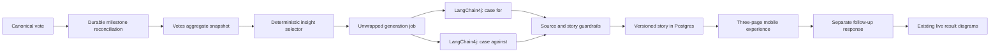

# Post Unwrapped agent architecture

Status: proposed for product decisions
Scope: completion-checklist points 2 and 4
Primary domain: `post-service/com.yoursay.agents.unwrappedagent`

## Goal

After a canonical vote, show exactly three Post Unwrapped pages:

1. the strongest evidence-backed case for the supporting option, grounded in safe audience
   aggregates and current external research;
2. the strongest evidence-backed case for the opposing option, with the same research and editorial
   standard;
3. the same voting options again, asking whether seeing the other context changes the user's view.

After page 3, open the existing aggregate diagrams. The second choice is research data only: it must
never alter the canonical vote, result totals, demographic breakdowns, or analysis milestones.

The agent is implemented with LangChain4j inside Quarkus. It receives aggregate data only. It never
receives a voter ID, email, individual vote, or an identity-characteristic pairing.

## Core architectural decision

Separate statistical truth from language-model judgement:

- deterministic Java code calculates aggregates, uncertainty, effect sizes, multiple-comparison
  corrections and the cohorts safe to discuss;
- LangChain4j researches relevant external context and writes the strongest responsible case for
  each option;
- deterministic validators reject unsupported, unbalanced or contract-invalid output;
- the mobile app renders a versioned JSON story contract, never model-generated UI or Markdown.

The LLM must not search across raw demographic buckets and decide which pattern “looks
interesting”. That would make results non-repeatable, encourage cherry-picking and make sparse
cohorts unsafe.



## Product behaviour

### Page 1 — the case for

The page contains:

- a clear argument headline;
- `Observed here`: one or two safe cohort findings from this post's canonical votes;
- `Wider context`: externally researched figures with claim-level citations;
- a persuasive synthesis explaining why the evidence may matter to supporters;
- a short caveat that the observed association does not establish why an individual voted.

### Page 2 — the case against

It has the same structure, data budget, source standard and approximate content budget as page 1.
“Equally persuasive” means equal research effort and charitable presentation. It does not mean
inventing a demographic difference or pretending the external evidence is equally strong.

If one side has no statistically safe over-indexing cohort, the page should say that this audience
does not yet show a reliable demographic concentration and make its case from the overall result
and sourced external context.

### Page 3 — reconsider the choice

This page is assembled by application code, not generated by the model. It shows:

- the original option selected;
- the original post question and the same immutable option IDs/label snapshots;
- `Has seeing the context from both sides changed your view?`;
- a single follow-up selection;
- a `Continue without answering` action if the follow-up is optional.

Submitting the same option is meaningful: it records that the user retained their view. The backend
derives the original option from the canonical vote; the client cannot supply or change it.

After submit or skip, navigate to the existing results explorer. The explorer fetches current
aggregates, which may be newer than the cached story, and should show `Story based on N votes` when
the counts differ.

## Backend domain boundaries

### `votes`

Owns canonical votes, private vote-time snapshots and all aggregation mathematics. Add public,
top-level aggregate contracts that the Unwrapped domain can consume:

- `PostAnalysisAggregateService`
- `PostAnalysisAggregateV1`
- `CohortAggregateV1`
- `OptionStatisticV1`
- `AggregationMetadataV1`

The implementation remains internal to `votes`. No vote entity, repository, user ID or individual
`CharacteristicSnapshot` crosses the domain boundary.

### `agents.unwrappedagent`

Owns:

- deterministic insight selection from the aggregate contract;
- analysis versions and milestone jobs;
- LangChain4j research services and prompts;
- story validation and source validation;
- stored story versions and citations;
- story/revote REST endpoints;
- generation metrics.

It may call only the top-level public contracts of `posts` and `votes`.

### `posts`

Supplies immutable public post context and voting configuration: support question, factual summary,
voting type and ordered option IDs/labels. The agent should not be given publisher-authored
`caseFor`/`caseAgainst` as evidence; those fields can bias what is meant to be independent research.

### Mobile `features/unwrapped`

Owns the story route, API client, state hook, three page components, evidence/citation drawer,
progress control and follow-up submission. Route files remain thin.

## Aggregate input contract

`PostAnalysisAggregateV1` is a versioned, immutable snapshot created before any provider call. A
representative shape is:

```json
{
  "schemaVersion": "post-analysis-aggregate-v1",
  "postId": 42,
  "votingType": "BINARY",
  "question": "Should public spending be reduced to lower income tax?",
  "options": [
    { "id": 101, "label": "Agree", "semanticKey": "AGREE", "ordinal": 0 },
    { "id": 102, "label": "Disagree", "semanticKey": "DISAGREE", "ordinal": 1 }
  ],
  "canonicalVoteCount": 250,
  "aggregateVersion": "sha256:...",
  "capturedAt": "2026-07-24T12:00:00Z",
  "overall": [
    { "optionId": 101, "count": 140, "percentage": 56.0 },
    { "optionId": 102, "count": 110, "percentage": 44.0 }
  ],
  "cohorts": [
    {
      "cohortId": "ageRange=AGE_25_34&gender=MAN",
      "dimensions": [
        { "axis": "ageRange", "bucket": "AGE_25_34" },
        { "axis": "gender", "bucket": "MAN" }
      ],
      "membershipSemantics": "EXCLUSIVE",
      "sampleSize": 62,
      "populationSharePercentage": 24.8,
      "options": [
        {
          "optionId": 101,
          "count": 43,
          "percentage": 69.35,
          "differenceFromOverallPercentagePoints": 13.35,
          "differenceFromRestPercentagePoints": 17.71,
          "wilson95Low": 57.03,
          "wilson95High": 79.40,
          "rawPValue": 0.012,
          "adjustedQValue": 0.041
        }
      ]
    }
  ],
  "metadata": {
    "ruleSetVersion": "cohort-rules-v1",
    "suppressBelow": 10,
    "minimumOverallSample": 100,
    "minimumCohortSample": 30,
    "minimumEffectPercentagePoints": 10.0,
    "falseDiscoveryRate": 0.05,
    "suppressedCohorts": 8,
    "testedComparisons": 91
  }
}
```

`differenceFromOverallPercentagePoints` satisfies the reporting contract and is intuitive in the
UI. Significance testing should compare the cohort with the rest of the sample, not with an overall
rate that includes that cohort.

Create the complete JSON aggregate inside one repeatable-read database transaction, then persist it
on the job before calling the external provider. The content hash becomes `aggregateVersion`. This
prevents different axis queries from seeing different vote counts while a story is generated.

## Completing characteristic aggregation

### Missing news-habit fields

Add the currently omitted vote-time fields:

- `balancedNewsViewpoint`;
- `mainstreamNewsPercent`;
- retain `newsFrequency`, but convert its raw 0–10 value into governed reporting bands.

Continuous/scale answers need stable labelled bands in a shared reporting catalog. Raw numeric
values must not be sent to the model as if every integer were a meaningful demographic.

Recommended initial bands:

- news frequency: `0–2`, `3–5`, `6–8`, `9–10`;
- mainstream news share: `0–24`, `25–49`, `50`, `51–75`, `76–100`.

The product wording for these bands should be approved before implementation.

### Multi-select fields

Stop joining selections into synthetic values such as `ASIAN+WHITE`. Use membership semantics:

- a voter selecting two values contributes once to each selected value's cohort;
- the denominator for each bucket is the number of voters who selected that value;
- buckets overlap, so their totals are not expected to sum to the overall total;
- responses explicitly declare `membershipSemantics: MULTI_MEMBERSHIP`;
- no page may add overlapping bucket counts together or describe them as population composition.

Overall option totals remain exclusive and unchanged. The first release should exclude multi-select
axes from intersections until the copy and privacy behaviour are proven.

### Intersections

The example “working-age men” requires intersections, but unconstrained combinations create a
privacy and false-discovery problem. For v1:

- allow at most two dimensions;
- generate only allowlisted, product-meaningful pairs;
- do not intersect two multi-select axes;
- apply the same suppression threshold before returning a cohort;
- require a larger sample than a single-axis cohort where practical;
- test all candidates before selecting any, then apply the multiple-comparison correction once
  across the complete candidate family.

Start with a small allowlist such as age × gender, age × occupation, age × employment sector,
income × gender and political persuasion × income. Sensitive pairings need explicit product/privacy
approval rather than automatic combinatorics.

## Recommended statistical rules for v1

These are proposed defaults, not hidden constants:

| Rule | Proposed default | Purpose |
| --- | ---: | --- |
| API/agent suppression | `k = 10` | Do not expose or narrate tiny buckets |
| Minimum overall sample for demographic narrative | `100` | Avoid unstable early stories |
| Minimum single-axis cohort sample | `30` | Basic estimate stability |
| Minimum two-axis cohort sample | `40` | Stronger protection for intersections |
| Minimum cohort share | `5%` | Avoid spotlighting a negligible slice |
| Minimum absolute effect | `10 percentage points` | Require practical importance |
| Interval | `95% Wilson interval` | Better binomial coverage than a normal interval |
| Significance comparison | cohort versus everyone outside the cohort | Avoid self-comparison |
| Small-cell test | Fisher exact | Valid when expected counts are small |
| Other test | two-proportion test | Efficient for adequately sized cells |
| Multiple comparisons | Benjamini–Hochberg, FDR `q <= 0.05` | Limit demographic cherry-picking |
| Insights per option | maximum `2` | Keep the story focused |

A cohort is narratable only when it passes privacy, sample, effect-size and corrected-uncertainty
gates. Rank passing cohorts by a documented score combining adjusted significance, effect size,
sample strength and non-redundancy. Do not show `men aged 25–34` and `people aged 25–34` together
when they describe substantially the same signal.

Do not claim this audience represents the UK or another country. Use “among people who voted on
this post” unless a future sampling design justifies population inference.

## Insight selection

For each option:

1. calculate all eligible single-axis and allowlisted intersection comparisons;
2. apply suppression and sample rules;
3. calculate effect sizes, intervals and raw p-values;
4. apply one multiple-comparison correction over the searched family;
5. remove redundant/nested cohorts;
6. select at most two diverse, highest-signal cohorts;
7. create a deterministic `CaseBriefV1`.

`CaseBriefV1` distinguishes:

- `observations`: exact Your Say aggregate statements;
- `researchQuestions`: topics worth researching, derived from the post and selected cohorts;
- `prohibitedInferences`: causation, representativeness and stereotypes the writer must avoid;
- `insufficientEvidence`: explicit reason when no demographic claim is safe.

Tests should pin the selected cohort IDs and exact statistics for deterministic fixtures. They
should also prove that sparse or noisy “dramatic” buckets are rejected.

## LangChain4j research workflow

The repository already uses Quarkus LangChain4j with an OpenAI-compatible xAI Responses model and
server-side `web_search`. Add a separately named `unwrapped` model configuration so its model,
reasoning effort, output budget, timeout and prompt-cache key can change without changing Pepper.

Use one stateless AI service interface:

```java
@RegisterAiService(
    modelName = "unwrapped",
    chatMemoryProviderSupplier = RegisterAiService.NoChatMemoryProviderSupplier.class
)
interface UnwrappedCaseResearchService {
    Result<ArgumentPageDraftV1> research(String caseBrief);
}
```

Call it twice per story:

- once with the support option's `CaseBriefV1`;
- once with the opposing option's `CaseBriefV1`.

Give both calls the same model, research instructions, maximum output budget and source rules. They
can run concurrently on virtual threads after the aggregate snapshot is committed. This isolates
each side's research budget and makes “equal treatment” measurable.

The prompt requires:

- current live web research;
- primary statistics, government sources and original research where possible;
- more than one independent source for material claims;
- actual dated figures rather than vague assertions;
- exact distinction between Your Say observations, external facts and interpretation;
- cautious `may`, `could` or `is consistent with` language for explanations;
- no inference that a protected characteristic causes a political belief;
- no invented symmetry;
- no unsupported number or citation;
- UK evidence only when the question/jurisdiction is UK-specific.

The model returns typed structured output. It does not return page HTML, React Native code or
arbitrary Markdown.

The existing service is pinned to the Quarkus LangChain4j `1.12.0` BOM. Keep that pin during this
slice unless a short compatibility spike proves an upgrade is required. Current xAI documentation
supports web search, structured outputs and structured citation annotations through the Responses
API; model selection remains configuration, not a Java constant.

Reference material checked for this plan:

- [Quarkus LangChain4j AI Services](https://docs.quarkiverse.io/quarkus-langchain4j/dev/ai-services.html)
  for typed response mapping and named model configuration;
- [Quarkus LangChain4j function calling](https://docs.quarkiverse.io/quarkus-langchain4j/dev/function-calling.html)
  and [observability](https://docs.quarkiverse.io/quarkus-langchain4j/dev/observability.html);
- [xAI web search](https://docs.x.ai/developers/tools/web-search),
  [citations](https://docs.x.ai/developers/tools/citations) and
  [structured outputs](https://docs.x.ai/developers/model-capabilities/text/structured-outputs).

## Story output contract

The server assembles `UnwrappedStoryV1` from the two validated agent drafts and the deterministic
follow-up page:

```json
{
  "schemaVersion": "unwrapped-story-v1",
  "storyId": "uuid",
  "postId": 42,
  "analysisVersion": "unwrapped-analysis-v1",
  "milestone": 250,
  "canonicalVoteCount": 263,
  "aggregateVersion": "sha256:...",
  "generatedAt": "2026-07-24T12:03:00Z",
  "model": "configured-model-name",
  "promptVersion": "unwrapped-case-v1",
  "ruleSetVersion": "cohort-rules-v1",
  "pages": [
    {
      "type": "ARGUMENT",
      "stance": "SUPPORT",
      "option": { "id": 101, "label": "Agree" },
      "headline": "The case for keeping more of what people earn",
      "observations": [],
      "contextClaims": [],
      "synthesis": "...",
      "caveat": "This pattern describes this vote; it does not prove why any person chose it."
    },
    {
      "type": "ARGUMENT",
      "stance": "OPPOSE",
      "option": { "id": 102, "label": "Disagree" },
      "headline": "The case for the services taxes fund",
      "observations": [],
      "contextClaims": [],
      "synthesis": "...",
      "caveat": "..."
    },
    {
      "type": "FOLLOW_UP",
      "question": "Has seeing the context from both sides changed your view?",
      "options": []
    }
  ],
  "sources": [],
  "methodology": {
    "suppressionThreshold": 10,
    "minimumCohortSample": 30,
    "multipleComparisonMethod": "BENJAMINI_HOCHBERG",
    "falseDiscoveryRate": 0.05
  }
}
```

Every observed item contains typed option/cohort/count/percentage fields and server-written display
copy. Every external claim contains:

- a stable claim ID;
- statement;
- optional typed figure (`value`, `unit`, `period`, `geography`);
- one or more citation IDs;
- `claimType: CONTEXT`;
- an interpretation label when it is a hypothesis rather than a sourced fact.

The client displays only known enum page/block types. Unknown future blocks are ignored safely.

## Source validation and content guardrails

Before a story can become `READY`:

- every claim must reference at least one source;
- every claimed URL must appear in the provider's returned citation set;
- every URL must be HTTPS and pass a safe URL parser;
- reject loopback, link-local, private-network and credential-bearing URLs;
- follow redirects only through the same network safety checks;
- record access time, publisher/domain, title where available and validation outcome;
- reject unreachable sources after bounded retries;
- reject unsupported domains configured as low quality;
- require a primary or high-quality research source for central numeric claims;
- validate all Your Say numbers directly against the persisted aggregate snapshot;
- reject missing options, invented cohort labels, unknown claim IDs and unbalanced page structure;
- enforce bounded lengths and approximately equal evidence budgets for both argument pages.

Do not store provider chain-of-thought. Retain the structured request, structured result, provider
response ID, citations, model and prompt/rule versions needed for audit.

A later independent claim-entailment pass can improve factual verification, but it should not be
mistaken for proof. Representative stories still need a human quality-evaluation set before release.

## Durable generation and milestones

Do not rely only on an after-commit event from `castVote`; a process crash or two simultaneous votes
can miss a threshold.

In the canonical vote transaction, upsert the post into a small durable reconciliation queue.
A worker then:

1. claims a dirty post with `SKIP LOCKED`;
2. reads its committed canonical count;
3. inserts every newly crossed milestone job;
4. relies on a unique `(post_id, milestone, analysis_version)` constraint;
5. removes or advances the dirty marker.

A periodic sweep reconciles posts as defence in depth. The worker creates the aggregate snapshot
once, persists it, performs external calls outside a transaction, validates output, then completes
the story transactionally.

Recommended initial demographic milestones are `100, 250, 500, 1,000`, followed by a configurable
growth rule. Serve the newest completed story at or below the current count. Continue serving the
previous story while a newer milestone is building.

Public states:

- `READY`: a completed eligible story;
- `BUILDING`: no eligible story yet, or the first is generating;
- `REFRESHING`: return the existing story plus a non-blocking freshness flag;
- `INSUFFICIENT_EVIDENCE`: enough processing occurred but no safe demographic story is possible;
- `FAILED`: no usable previous story and generation exhausted retries.

Voting must succeed even if queueing, research or the provider is unavailable.

## Persistence

Add separate Liquibase migrations for:

### `unwrapped_analysis_job`

- UUID primary key;
- post ID, milestone and analysis version;
- unique constraint on `(post_id, milestone, analysis_version)`;
- status, attempt count, next attempt, lease/claim timestamps;
- canonical count and persisted aggregate JSON/hash;
- model/prompt/rule/schema versions;
- provider response IDs;
- bounded public error code/message;
- created/started/completed timestamps.

### `unwrapped_story`

- UUID story ID;
- source job FK;
- post ID, milestone, canonical count and aggregate version;
- story schema/analysis/model/prompt/rule versions;
- immutable option label snapshots;
- validated story JSON;
- status and generation timestamps.

Completed stories are immutable. A regenerated prompt/model creates a new analysis version rather
than overwriting what earlier users saw.

### `unwrapped_source`

- story ID and stable citation ID;
- canonical URL plus publisher/title;
- publication date when known and access timestamp;
- source tier/type and validation outcome.

### `unwrapped_follow_up`

- UUID primary key;
- private user ID;
- post ID and story ID;
- original canonical option ID and follow-up option ID;
- created timestamp;
- unique `(user_id, post_id, story_id)`;
- composite option/post foreign keys proving both options belong to that post.

This table is never read by canonical aggregation or milestone code.

## REST API

All endpoints remain authenticated and post-vote gated:

- `GET /posts/{postId}/unwrapped`
  - returns the newest eligible story/state;
  - confirms the caller has a canonical vote;
  - never personalises the shared story with private characteristics.
- `POST /posts/{postId}/unwrapped/{storyId}/follow-up`
  - body contains only `optionId`;
  - server resolves caller, canonical vote and story;
  - returns `201`, or the existing response idempotently;
  - rejects a story for another post or an option not owned by the post.
- existing sentiment endpoints remain the source for diagrams after page 3.

Use the exact `storyId` delivered to the mobile app for follow-up submission. If a refresh completes
while someone is reading, their response remains attached to the story they actually saw.

## Mobile implementation

Add:

```text
app/(protected)/posts/[postId]/unwrapped.tsx
features/unwrapped/
  index.ts
  types.ts
  components/
  hooks/
  services/
```

Flow changes:

- a successful canonical vote replaces/pushes the feed with the Unwrapped route;
- returning voters can replay Unwrapped from the post;
- argument pages use a fixed horizontal pager with progress `1 of 3`, explicit Next/Back controls
  and reduced-motion support;
- long research is expressed as concise evidence cards with an expandable evidence/citation drawer,
  rather than an unreadable wall of text;
- screen-reader order follows headline → observed data → context → synthesis → caveat → sources;
- page 3 submits once, handles an existing response, and then opens the current result diagrams;
- building, insufficient, failed, offline and stale-story states all provide a route to factual
  results rather than trapping the voter.

Do not nest a horizontal gesture pager inside uncontrolled horizontal charts. The results explorer
opens after the story instead of becoming a fourth page.

## Security and privacy

- Keep the existing aggregate-only contract as the only agent input.
- Apply one suppression policy to direct results and agent input; the agent may be stricter, never
  looser.
- Do not put user IDs, individual selected options or characteristic snapshots in prompts, story
  rows, telemetry or logs.
- Log job/story IDs, post ID, version, outcome, duration, bounded source count and token/cost usage.
- Do not log post copy, generated prose, option labels or demographic values in metrics.
- Treat model output and researched URLs as untrusted input.
- Add an ADR for statistical narration/privacy rules and another for the durable cached-story and
  follow-up model, or one combined ADR if those decisions are approved together.

## Verification strategy

### Pure unit tests

- exact option percentages, differences and Wilson intervals;
- Fisher/two-proportion test selection;
- Benjamini–Hochberg correction with pinned q-values;
- suppression, minimum samples and effect thresholds;
- intersection allowlist and multi-membership semantics;
- redundant insight removal and per-side selection;
- story/source validator rejection for every unsupported contract state.

### Backend integration tests

- agent input contains aggregates but no identity or individual rows;
- exact fixture produces exact selected and omitted insights;
- concurrent threshold crossing creates one milestone job;
- a missed event is recovered by durable reconciliation;
- previous story remains available during refresh;
- provider failure retries and reaches an honest terminal state;
- results and story remain gated until canonical vote;
- one follow-up per user/post/story;
- duplicate follow-up is idempotent;
- cross-post story/option is rejected;
- follow-up leaves canonical results and milestone count byte-for-byte unchanged.

Provider calls are replaced with a fake `UnwrappedResearchGenerator` in normal CI. A manually run,
key-required smoke test verifies the real LangChain4j/xAI schema and citation metadata.

### Agent quality evaluation

Create deterministic scenarios for:

- a clear support-side intersection and clear opposition-side single-axis cohort;
- sparse dramatic buckets that must be omitted;
- no statistically meaningful cohort differences;
- conflicting external evidence;
- a topic with no good current sources;
- UK-specific and non-UK questions;
- binary and the agreed multiple-choice policy.

Evaluate factual numbers, citation coverage, correlation/causation wording, stereotyping, equal
editorial effort and whether breaking the implementation would make the tests fail. Run the
repository `test-audit` skill after test changes.

### Mobile tests

- canonical vote routes to Unwrapped;
- exactly three pages render in order;
- citations and caveats are reachable;
- Back/Next, swipe, replay and reduced-motion behaviour;
- follow-up same-choice and changed-choice submission;
- skip behaviour if approved;
- results open only after the page-3 action;
- building, insufficient, failed, offline and stale states.

## Delivery sequence

1. Approve the open product/statistical decisions below and record the ADR.
2. Complete vote snapshots for the two omitted news-habit fields and introduce governed reporting
   bands.
3. Replace joined multi-select buckets with explicit membership semantics.
4. Implement `PostAnalysisAggregateV1`, single-axis/intersection aggregation and statistical
   metadata.
5. Build deterministic fixture populations and prove insight selection without an LLM.
6. Add Unwrapped job/story/source/follow-up migrations and durable milestone reconciliation.
7. Add the LangChain4j case-research adapter, prompts, structured outputs and validators.
8. Add the gated story and follow-up APIs.
9. Build the three-page mobile feature and route successful votes into it.
10. Wire page 3 into the existing results diagrams.
11. Add telemetry, live-provider smoke testing, offline quality evaluation, accessibility and load
    checks.

The first implementation PR should stop after step 5. It gives a reviewable, deterministic
aggregate/analysis contract before provider cost, generated prose, persistence and UI are layered
on top.

## Decisions required

1. **Voting types:** Are the first two pages restricted to binary Agree/Disagree posts? Recommended:
   yes for v1. For multiple choice, two pages cannot fairly represent 3–5 options; that needs a
   separate product rule such as selected option versus strongest alternative.
2. **Jurisdiction:** Is MVP1 UK-only, or can posts concern other countries? Recommended: add an
   explicit post jurisdiction/market field rather than infer it from prose.
3. **Privacy/statistics:** Approve or change the proposed `k=10`, overall `n=100`, cohort `n=30/40`,
   10-point effect and FDR `q=0.05` rules. This supersedes the roadmap's risky `k=0` release default.
4. **Early voters:** Before 100 votes, should users see a building/insufficient state and then raw
   results, or should we create a context-only story with no demographic claims? Recommended:
   context-only only if it can be generated once per post at publication; never pretend early
   audience data is meaningful.
5. **Follow-up:** Is page 3 optional, and may users skip it? Recommended: yes; coercing a research
   response will reduce data quality.
6. **Multiple versions:** May the same user answer again after a genuinely new story milestone?
   The roadmap currently says yes, once per story/analysis version.
7. **Provider:** Reuse the existing xAI/Grok Responses API and live web search, or select a different
   provider? Recommended: reuse the existing integration behind an `UnwrappedResearchGenerator`
   interface.
8. **Research budget:** Is the quality target worth two live-search calls per generated story plus
   an optional verifier call? This determines generation cost and latency budgets.
9. **Source policy:** Should social posts, newspapers behind hard paywalls and advocacy-group
   research be allowed as supporting sources? Recommended: no social posts for numeric claims;
   advocacy sources may explain a side's stated case but should not be the sole evidence.
10. **Publication control:** Are validated stories automatically released, or does the first version
    require internal editorial approval? Recommended: editorial review during beta, then
    auto-release only after the evaluation set meets agreed quality gates.
11. **Page density:** Should each argument page remain a concise 45–90 second read with expandable
    evidence, or display the complete long-form research inline? Recommended: concise main page with
    full figures and sources in an evidence drawer.
